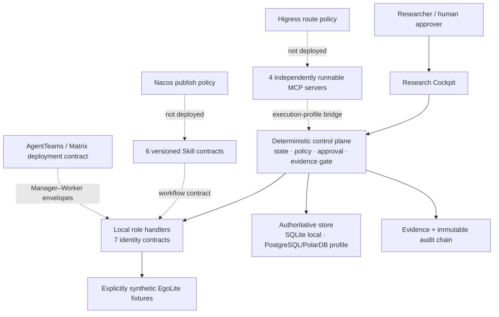

# Architecture

EgoAgentOS ResearchOps turns embodied-AI experimentation into a governed production
workflow. The architecture deliberately separates collaborative reasoning from
authoritative state and deterministic verification.

Solid arrows are the shipped local runtime. Dashed arrows are integration contracts or
an optional execution profile; they are not evidence that an external service is live.

## Deterministic core, model residual

The deterministic core owns schema validation, state transitions, concurrency version,
risk classification, approval scope, idempotency, metric computation, canonical hashing,
evidence completeness, decision authorization, and validated memory writes. An LLM or
Agent may interpret a goal, propose a hypothesis, explain metrics, or draft a review; it
cannot mutate these invariants.

## Shipped local control and data flow

1. The PI freezes natural-language intake into a versioned `ResearchGoal` digest.
2. Deterministic stage handlers emit role-attributed, synthetic context and experiment
   artifacts under the seven machine-readable Agent identity boundaries.
3. Policy classifies the exact R2 action and pauses for a human approval bound to task
   generation, scope, action digest, expiry, and a one-time nonce.
4. The local executor records a canonical `RunManifest`; it does not claim a real GPU
   launch. The MCP tool plane can be tested separately and through its explicit bridge.
5. Evaluation computes paired metrics from raw synthetic samples. A separate Reviewer
   identity covers every non-review producer before the evidence gate can pass.
6. The gate authorizes the fixed local `KEEP`/`INCONCLUSIVE` decision path. Archived
   evidence then becomes validated memory and a draft Skill candidate.

The AgentTeams target profile uses the same identity and envelope contracts for live
Manager–Worker collaboration. That deployment is intentionally reported as
`not_configured` in this repository until a Matrix handshake is captured.

## Deployment profiles

- `local`: API + Web + SQLite + filesystem artifacts + deterministic simulator. This is
  the default and the only profile required for a judge replay.
- `platform` (target contract): PostgreSQL-compatible DB, object storage, OTel collector,
  AgentTeams, Higress, and Nacos. The current health API reports external endpoints as
  `not_configured` or `configured_unverified`; it does not probe or certify them.
- `lab`: platform profile plus a real scheduler/GPU adapter and a trusted dataset root.

The local profile is a functioning control-plane path, not a static UI. Agent reasoning,
the model workload, and hardware telemetry in the included EgoLite scenario are
deterministic synthetic fixtures and visibly labeled.
