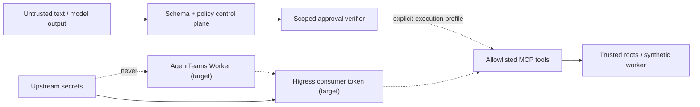

# Security model

## Assets and trust boundaries

Protected assets include upstream credentials, research code, datasets, checkpoints,
raw metrics, approval authority, evidence bytes, and the active configuration pointer.
Untrusted inputs include user goals, retrieved text, Matrix chat, model output, repository
content, tool output, and uploaded Skill packages.

Solid edges are exercised locally. Dashed edges are deployment boundaries and are not
reported as live by the default Web replay.

## Risk policy

| Level | Examples | Authorization |
|---|---|---|
| R0 | read repo/log/metric, evaluate fixtures | automatic + audit |
| R1 | single GPU, ≤2 GPU-hour, sandbox-only mutation | policy record + audit |
| R2 | multi-GPU/expensive run, large code/data mutation | human approval |
| R3 | delete, push main, publish model, deploy, irreversible API | human approval + rollback point + audit |

The control-plane approval record binds task generation, approver, exact action digest,
scope, expiry, and token hash. The GPU execution token contract additionally binds the
canonical launch payload. Both are single-use. A generic “approved” chat message has no
power.

## Tool constraints

- Entrypoints are enums mapped to administrator-owned programs.
- Arguments are arrays and execution uses `shell=false`.
- Config and data paths must resolve below trusted roots; symlink escape is rejected.
- GPU IDs, time, output destinations, and publication behavior cannot exceed approval.
- Idempotency keys prevent duplicate expensive actions.
- Tool annotations are metadata, never the authorization mechanism.
- Logs redact authorization headers, access keys, tokens, and configured secret patterns.

## Evidence integrity

Canonical SHA-256 binds code commit, configuration, dataset manifest, environment lock,
base model, and seed in the local `RunManifest`. Each local evidence record binds task,
generation, kind, producer, payload digest, and synthetic label. URI/byte-size/object
verification fields belong to the target artifact-store schema and are not fabricated in
the SQLite replay. Raw paired samples are retained in metric evidence; narrative
summaries cannot substitute for them.

## Threat tests

The test suite covers illegal transitions, approval absence/scope/expiry/replay, digest
tampering, non-independent review, missing evidence kinds, unknown entrypoints, path
traversal/symlink escape, shell injection strings, and secret redaction. A platform claim
is “verified” only when the corresponding live negative tests also pass.
